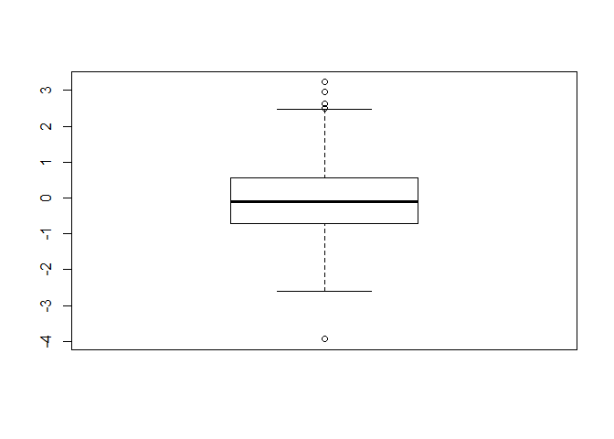
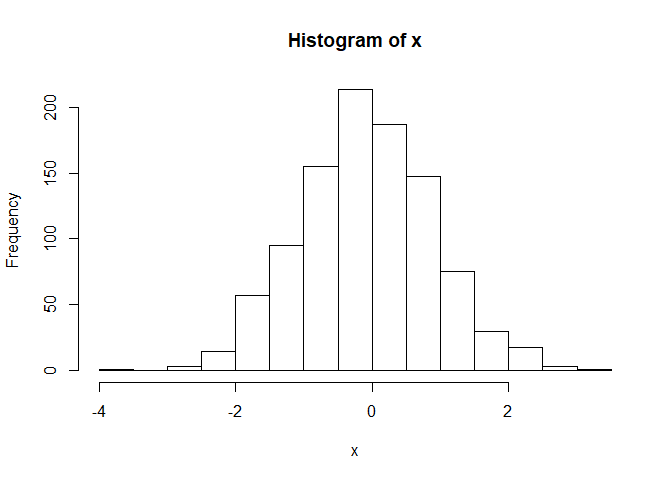
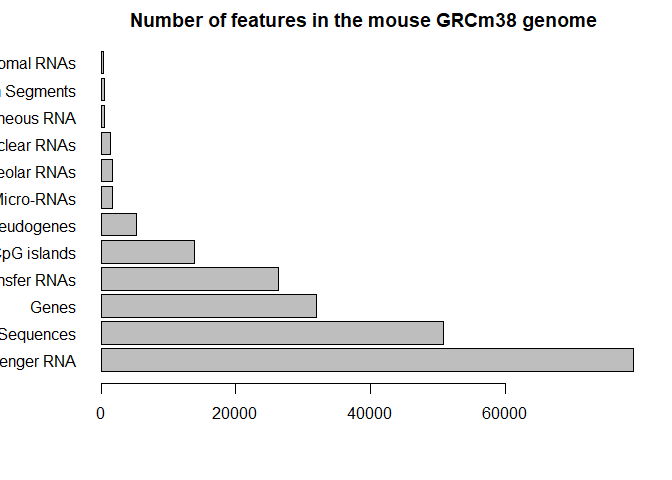
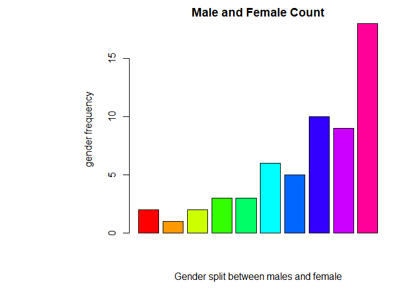

class05: Data exploration and visualization in R
================
Philip Le
Oct 17 2019

``` r
#Class 5 - Data visualization
```

output:github\_document

``` r
#Section 1 X
x <- rnorm(1000)
mean(x)
```

    ## [1] -0.07119924

``` r
sd(x)
```

    ## [1] 0.9738025

``` r
summary(x)
```

    ##     Min.  1st Qu.   Median     Mean  3rd Qu.     Max. 
    ## -3.93614 -0.70580 -0.09001 -0.07120  0.56858  3.22740

``` r
boxplot(x)
```

<!-- -->

``` r
hist(x)
```

<!-- -->

``` r
#section 2 scatterplots
#read input file"weight_chart"
#parameters in read.csv() corresponds to adjustable traits
read.table("bimm143_05_rstats/weight_chart.txt")
```

    ##     V1     V2
    ## 1  Age Weight
    ## 2    0    3.6
    ## 3    1    4.4
    ## 4    2    5.2
    ## 5    3      6
    ## 6    4    6.6
    ## 7    5    7.2
    ## 8    6    7.8
    ## 9    7    8.4
    ## 10   8    8.8
    ## 11   9    9.2

``` r
read.table("bimm143_05_rstats/weight_chart.txt", header = TRUE)
```

    ##    Age Weight
    ## 1    0    3.6
    ## 2    1    4.4
    ## 3    2    5.2
    ## 4    3    6.0
    ## 5    4    6.6
    ## 6    5    7.2
    ## 7    6    7.8
    ## 8    7    8.4
    ## 9    8    8.8
    ## 10   9    9.2

``` r
#2B
mouse<- read.table("bimm143_05_rstats/feature_counts.txt" ,sep="\t")

#barplot(features$Count,horiz=TRUE)


#barplot(features$Count,horiz=TRUE, names.arg=mouse$Feature,main="mouse", las=1)

par(mar=c(5,5,2,2))

?par
```

    ## starting httpd help server ... done

``` r
mouse<-read.delim("bimm143_05_rstats/feature_counts.txt",header = TRUE, sep="\t")
barplot(mouse$Count, names.arg = mouse$Feature, main= "Number of features in the mouse GRCm38 genome", las=1, horiz=TRUE)
```

<!-- -->

``` r
par(mar=c(5,11,2,2))$mar
```

    ## [1] 5 5 2 2

``` r
#section 3
maleFemale <- read.delim("bimm143_05_rstats/male_female_counts.txt")
barplot(maleFemale$Count,main="Male and Female Count", col=rainbow(10), xlab="Gender split between males and female",ylab="gender frequency")
```

<!-- -->
