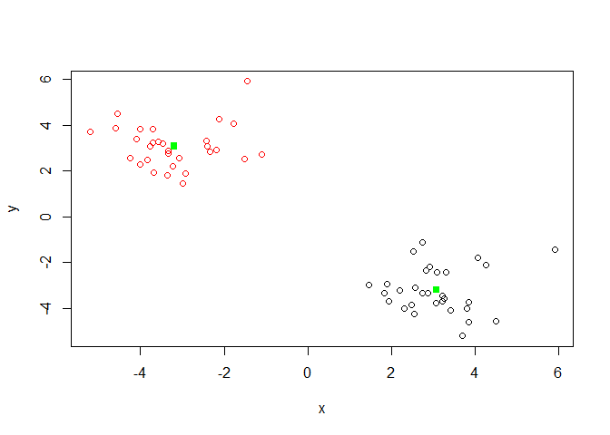

Class08
================
Philip Dai Le
10/24/2019

\-unsupervised learning: learning based on finding patterns or structure
in unlabeled data

\-supervised learning: making predictions based on label data; predict
based on classification

\-Reinforcement learning: learning based on past experience; like
self-driving cars

LECTURE 8:10/24/19 Clustering -K-means clustering: groups up
numbers/info into groups of K

\-K assigns random initial cluster starts and measures the distance
between them then compare the relative distances to make a good group

\-K also looks at total variance of the clusters until every point is
assigned

\-K will know the best answer by measuring all iterations with different
variations

\-Adding additional dimensions

\-Same like K, will pick random points and measure distances then group
based on best deviation/variance

\-K-means: random component -X:numeric matrix or data frane -Look for
elbow point of scree plot for best K; indicates best clustering

\#\#K-means clustering

``` r
# Generate some example data for clustering
tmp <- c(rnorm(30,-3), rnorm(30,3))
#30,-3 will be one cluster of 30 at -3 and vice verse for 30,3
x <- cbind(x=tmp, y=rev(tmp))
plot(x)
```

<!-- --> Use
the kmeans() function setting k to 2 and nstart=20 Inspect/print the
results Q. How many points are in each cluster? 30 points

Q. What ‘component’ of your result object details - cluster size?
\#"\(" will denote specific factors of the function  #k\)size 30 30

  - cluster assignment/membership? \#k$cluster \[1\] 2 2 2 2 2 2 2 2 2 2
    2 2 2 2 2 2 2 2 2 2 2 2 2 2 2 2 2 2 2 2 1 \[32\] 1 1 1 1 1 1 1 1 1 1
    1 1 1 1 1 1 1 1 1 1 1 1 1 1 1 1 1 1 1

  - cluster center? \#k$centers x y 1 -3.003845 3.038557 2 3.038557
    -3.003845

Plot x colored by the kmeans cluster assignment and add cluster centers
as blue points

``` r
k<-kmeans(x,centers= 2, nstart=20)
k$size
```

    ## [1] 30 30

``` r
#size = number of points/value

k$cluster
```

    ##  [1] 2 2 2 2 2 2 2 2 2 2 2 2 2 2 2 2 2 2 2 2 2 2 2 2 2 2 2 2 2 2 1 1 1 1 1 1 1 1
    ## [39] 1 1 1 1 1 1 1 1 1 1 1 1 1 1 1 1 1 1 1 1 1 1

``` r
#cluster means: cluster centers

k$centers
```

    ##           x         y
    ## 1  3.080879 -3.201544
    ## 2 -3.201544  3.080879

``` r
plot(x, col=k$cluster,)
#can use numbers to specific colors or color by cluster

points(k$centers, col="green", pch=15)
```

<!-- -->

``` r
#pch makes the center solid
```

Disadvantage of K is having multiple iterations and deciphering which is
best, so user imposing ruling/parameter = error

Hierarchical Clustering -initially each point is treated as its own
cluster -Then looking for points closest together -Then look more next
closest -Eventually start grouping pairs of points together until one
big cluster

Significantly more flexibile, but more work -need to input distance

\#\#hierarchical clustering in R hclust() function requires distance
matrix as input. Use “dist()” function as input

``` r
# First we need to calculate point (dis)similarity
# as the Euclidean distance between observations
dist_matrix <- dist(x)
# The hclust() function returns a hierarchical
# clustering model
hc <- hclust(d = dist_matrix)
# the print method is not so useful here
hc
```

    ## 
    ## Call:
    ## hclust(d = dist_matrix)
    ## 
    ## Cluster method   : complete 
    ## Distance         : euclidean 
    ## Number of objects: 60

``` r
hclust(d = dist_matrix)
```

    ## 
    ## Call:
    ## hclust(d = dist_matrix)
    ## 
    ## Cluster method   : complete 
    ## Distance         : euclidean 
    ## Number of objects: 60

``` r
plot(hc)
abline(h=6, col="magenta")
```

<!-- -->

``` r
#adds in a colored line at height H or by number of clusters k=#

cutree(hc, k=4)
```

    ##  [1] 1 1 1 1 1 1 1 1 1 1 1 1 1 1 1 1 1 1 1 1 1 1 1 1 1 2 1 1 1 1 3 3 3 3 4 3 3 3
    ## [39] 3 3 3 3 3 3 3 3 3 3 3 3 3 3 3 3 3 3 3 3 3 3

``` r
#look at the biggest jump/gap between branches. These are big changes in variance thus good places to cut
```

\#\#Linking Clusters Complete - links clusters based on largest distance
between points Single - links clusters based on smallest distance

``` r
# Step 1. Generate some example data for clustering
x <- rbind(
 matrix(rnorm(100, mean=0, sd = 0.3), ncol = 2), # c1
 matrix(rnorm(100, mean = 1, sd = 0.3), ncol = 2), # c2
 matrix(c(rnorm(50, mean = 1, sd = 0.3), # c3
 rnorm(50, mean = 0, sd = 0.3)), ncol = 2))
colnames(x) <- c("x", "y")
# Step 2. Plot the data without clustering
plot(x)
```

<!-- -->

``` r
# Step 3. Generate colors for known clusters
# (just so we can compare to hclust results)
col <- as.factor( rep(c("c1","c2","c3"), each=50) )
plot(x, col=col)
```

<!-- -->

``` r
#clustering code
h<-hclust(dist(x))

#draw tree code
plot(h)
abline(h=1.75, col="green")
```

<!-- -->

``` r
#Cut tree into clusters
grps<-cutree(h, k=3)
grps
```

    ##   [1] 1 1 2 1 1 2 2 1 1 1 1 1 1 1 1 1 1 2 2 1 1 1 1 1 2 1 1 1 1 1 1 1 1 1 1 1 2
    ##  [38] 1 1 1 1 2 1 1 1 1 1 1 1 1 3 3 3 2 3 3 3 3 3 3 3 3 3 3 2 3 3 3 3 3 3 3 3 2
    ##  [75] 3 3 3 3 3 3 3 3 3 2 3 3 3 3 3 3 3 3 3 3 3 3 3 3 3 3 2 2 2 2 2 2 2 2 2 1 2
    ## [112] 2 2 2 2 2 2 2 2 2 2 2 2 3 2 2 2 3 3 2 2 2 3 3 2 3 2 2 2 2 2 2 2 2 2 2 2 3
    ## [149] 3 2

How many points in each cluster?

``` r
table(grps)
```

    ## grps
    ##  1  2  3 
    ## 43 53 54

Cross-tabulate i.e. compare our clustering results with the known answer

``` r
table(grps, col)
```

    ##     col
    ## grps c1 c2 c3
    ##    1 42  0  1
    ##    2  8  4 41
    ##    3  0 46  8

## Dimensional Analysis

**PCA** - Principal component Analysis useful for observing a high
dimensional data set and reduce it down to principal components or most
key information

``` r
mydata <- read.csv("https://tinyurl.com/expression-CSV",
 row.names=1)

head(mydata)
```

    ##        wt1 wt2  wt3  wt4 wt5 ko1 ko2 ko3 ko4 ko5
    ## gene1  439 458  408  429 420  90  88  86  90  93
    ## gene2  219 200  204  210 187 427 423 434 433 426
    ## gene3 1006 989 1030 1017 973 252 237 238 226 210
    ## gene4  783 792  829  856 760 849 856 835 885 894
    ## gene5  181 249  204  244 225 277 305 272 270 279
    ## gene6  460 502  491  491 493 612 594 577 618 638

``` r
pca<-prcomp(t(mydata), scale = TRUE)
#"t" is to transpose the data because genes has to be columns not rows
dim(mydata)
```

    ## [1] 100  10

``` r
#100 genes and 10 experiments
nrow(mydata)
```

    ## [1] 100

``` r
attributes(pca)
```

    ## $names
    ## [1] "sdev"     "rotation" "center"   "scale"    "x"       
    ## 
    ## $class
    ## [1] "prcomp"

``` r
pca$x
```

    ##           PC1        PC2        PC3        PC4        PC5        PC6
    ## wt1 -9.697374  1.5233313 -0.2753567  0.7322391 -0.6749398 -1.1823860
    ## wt2 -9.138950  0.3748504  1.0867958 -1.9461655  0.7571209  0.4369228
    ## wt3 -9.054263 -0.9855163  0.4152966  1.4166028  0.5835918 -0.6937236
    ## wt4 -8.731483 -0.7468371  0.5875748  0.2268129 -1.5404775  1.2723618
    ## wt5 -9.006312 -0.2945307 -1.8498101 -0.4303812  0.8666124  0.2496025
    ## ko1  8.846999  2.2345475 -0.1462750 -1.1544333 -0.6947862 -0.7128021
    ## ko2  9.213885 -3.2607503  0.2287292 -0.7658122 -0.4922849 -0.9170241
    ## ko3  9.458412 -0.2636283 -1.5778183  0.2433549  0.3654124  0.5837724
    ## ko4  8.883412  0.6339701  1.5205064  0.7760158  1.2158376  0.1446094
    ## ko5  9.225673  0.7845635  0.0103574  0.9017667 -0.3860869  0.8186668
    ##             PC7         PC8         PC9         PC10
    ## wt1  0.24446614  1.03519396  0.07010231 3.691492e-15
    ## wt2  0.03275370  0.26622249  0.72780448 3.080869e-15
    ## wt3  0.03578383 -1.05851494  0.52979799 2.595146e-15
    ## wt4  0.52795595 -0.20995085 -0.50325679 3.122502e-15
    ## wt5 -0.83227047 -0.05891489 -0.81258430 3.302913e-15
    ## ko1  0.07864392 -0.94652648 -0.24613776 3.351486e-15
    ## ko2 -0.30945771  0.33231138 -0.08786782 2.629841e-15
    ## ko3  1.43723425  0.14495188  0.56617746 3.094747e-15
    ## ko4  0.35073859  0.30381920 -0.87353886 2.983724e-15
    ## ko5 -1.56584821  0.19140827  0.62950330 3.233525e-15

``` r
plot(pca$x[,1], pca$x[,2])
```

<!-- -->

``` r
pca.var<-pca$sdev^2
pca.var.per <-round(pca.var/sum(pca.var)*100, 1) #the 1 dictates sigfig count
pca.var.per
```

    ##  [1] 92.6  2.3  1.1  1.1  0.8  0.7  0.6  0.4  0.4  0.0

``` r
barplot(pca.var.per, main="Scree Plot",
 xlab="Principal Component", ylab="Percent Variation")
```

<!-- -->

``` r
colvec <- colnames(mydata)
colvec[grep("wt", colvec)] <- "red"
colvec[grep("ko", colvec)] <- "blue"
plot(pca$x[,1], pca$x[,2], col=colvec, pch=16,
 xlab=paste0("PC1 (", pca.var.per[1], "%)"),
 ylab=paste0("PC2 (", pca.var.per[2], "%)")) 
```

<!-- -->

``` r
plot(pca$x[,1], pca$x[,2], col=colvec, pch=16,
 xlab=paste0("PC1 (", pca.var.per[1], "%)"),
 ylab=paste0("PC2 (", pca.var.per[2], "%)"))
## Click to identify which sample is which
identify(pca$x[,1], pca$x[,2], labels=colnames(mydata))
```

<!-- -->

    ## integer(0)

``` r
## Press ESC to exit… 
```

``` r
x <- read.csv("UK_foods.csv")
dim(x)
```

    ## [1] 17  5

``` r
head(x)
```

    ##                X England Wales Scotland N.Ireland
    ## 1         Cheese     105   103      103        66
    ## 2  Carcass_meat      245   227      242       267
    ## 3    Other_meat      685   803      750       586
    ## 4           Fish     147   160      122        93
    ## 5 Fats_and_oils      193   235      184       209
    ## 6         Sugars     156   175      147       139

``` r
rownames(x) <-x[,1]
x<-x[,-1] #dangerous way due to will constantly reiterate -1 every time you run it
head(x)
```

    ##                England Wales Scotland N.Ireland
    ## Cheese             105   103      103        66
    ## Carcass_meat       245   227      242       267
    ## Other_meat         685   803      750       586
    ## Fish               147   160      122        93
    ## Fats_and_oils      193   235      184       209
    ## Sugars             156   175      147       139

``` r
dim(x)
```

    ## [1] 17  4

``` r
x<-read.csv("UK_foods.csv", row.names=1)
head(x)
```

    ##                England Wales Scotland N.Ireland
    ## Cheese             105   103      103        66
    ## Carcass_meat       245   227      242       267
    ## Other_meat         685   803      750       586
    ## Fish               147   160      122        93
    ## Fats_and_oils      193   235      184       209
    ## Sugars             156   175      147       139

``` r
barplot(as.matrix(x), beside=F, col=rainbow(nrow(x)))
```

<!-- -->

``` r
pca<-prcomp(t(x))
summary(pca)
```

    ## Importance of components:
    ##                             PC1      PC2      PC3       PC4
    ## Standard deviation     324.1502 212.7478 73.87622 4.189e-14
    ## Proportion of Variance   0.6744   0.2905  0.03503 0.000e+00
    ## Cumulative Proportion    0.6744   0.9650  1.00000 1.000e+00

``` r
plot(pca$x[,1],pca$x[,2], xlab="PC1", ylab="PC2", xlim=c(-270,500))
text(pca$x[,1],pca$x[,2], colnames(x))
```

<!-- --> Q1.
How many rows and columns are in your new data frame named x? What R
functions could you use to answer this questions?

17

Q2. Which approach to solving the ‘row-names problem’ mentioned above do
you prefer and why? Is one approach more robust than another under
certain circumstances?

My preferred method would be to code in the row.name argument when
initializing X
