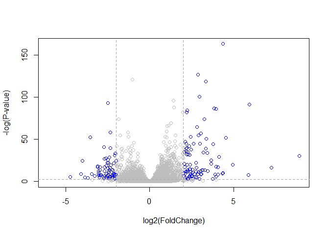
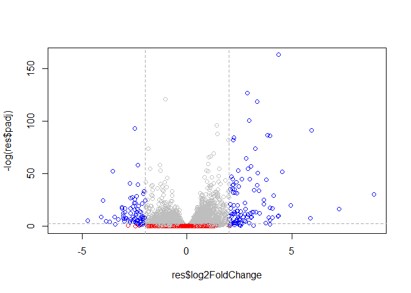

Class13(RNA-Seq)
================
Philip Dai Le
11/12/2019

\#\#Lecture 14 - RNA-seq

Installing key packages needed for RNA-seq analysis

``` r
#install.packages("BiocManager")

#For this class, need DESeq2 as well; BiocManager to ensure the package gets pulled from the BiocManager

#BiocManager::install("DESeq2")
```

**Hands-on** notes \*Gene of interest: CRISPLD2 - codes for secreted
protein used in lung development

\+Mutation (SNPS) - corticosteroid resistance and bronchodilator
response in asthma patients +Data analyzed with Tophat and Cufflinks
+CRISPLD2 mRNA expression examined with qPCR

Importing countData and colData

``` r
#reading in data files, sensitive to file name and location of file
counts <- read.csv("airway_scaledcounts.csv", stringsAsFactors = FALSE)
metadata <-  read.csv("airway_metadata.csv", stringsAsFactors = FALSE)
```

Looking into the file

``` r
head(counts)
```

    ##           ensgene SRR1039508 SRR1039509 SRR1039512 SRR1039513 SRR1039516
    ## 1 ENSG00000000003        723        486        904        445       1170
    ## 2 ENSG00000000005          0          0          0          0          0
    ## 3 ENSG00000000419        467        523        616        371        582
    ## 4 ENSG00000000457        347        258        364        237        318
    ## 5 ENSG00000000460         96         81         73         66        118
    ## 6 ENSG00000000938          0          0          1          0          2
    ##   SRR1039517 SRR1039520 SRR1039521
    ## 1       1097        806        604
    ## 2          0          0          0
    ## 3        781        417        509
    ## 4        447        330        324
    ## 5         94        102         74
    ## 6          0          0          0

Counting number of genes

``` r
nrow(counts) #38694 genes
```

    ## [1] 38694

Counting number of experiments

``` r
ncol(counts) #9experiments
```

    ## [1] 9

Looking into the metadata

``` r
View(metadata)
nrow(metadata) #8 due to the first row being gene name so 8 experiments
```

    ## [1] 8

\#\#Finding the average of the metadata Seeing if there’s a difference
in expression values for control (non-drug) vs treated (drugs added to
cell line).

Initial step, to find which experiments were control and get the average
values across all control experiments. Following, we’ll find which
experiments were treated and then find the average of the experimented
values.

``` r
control <- metadata[metadata[,"dex"]=="control",]
control.mean <- rowSums( counts[ ,control$id] )/4 
names(control.mean) <- counts$ensgene

treat <-metadata[metadata [,"dex"]=="treated",]
treat.mean <-rowSums (counts [,treat$id])/4
names(treat.mean)<- counts$ensgene

meancounts <-data.frame(control.mean,treat.mean)
colSums(meancounts)
```

    ## control.mean   treat.mean 
    ##     23005324     22196524

How to make this code more robust? adjust “4” in averaging data with
control$id to account for varying length/amount of data

``` r
#counts[,control$id] #factors in the number of rows

#controlRE <- metadata[metadata[,"dex"]=="control",]
#control.meanRE<- rowSums(counts[,controlRE$id])/ length(controlRE$id)
#names(control.meanRE) <- counts$ensgene

#treatRE <-metadata[metadata[, "dex"]=="treated",]
#treat.meanRE <- rowSums (counts[, treatRE$id])/ length(treatRE$id)
#names(treat.meanRE) <- counts$ensgene

#meancountsRE <- data.frame(control.meanRE, treat.meanRE)
#colSums(meanscountsRE)
```

Plotting control vs treated

``` r
#plot.default(meanscountsRE)
#plot(meancountsRE$control.meanRE, meancountsRE$treat.meanRE, log= "xy", xlab= "control", ylab="treated", col="black")
#?plot.default()
```

Assessing drug treatmeant effect by comparing data values of treated vs
control

``` r
#meancountsRE$log2fc <- log2(meancountsRE[,"treat.meanRE"]/meancountsRE[,"control.meanRE"])
#head(meancountsRE)

#meancountsRE$log2fc is to create an extra column for log
#0.00 means no data or no expression
```

Determining location of zeroes in a matrix and using the “which”
function. The “which” function informs which elements meets a criteria.
“arr.ind = TRUE” returns the results of a function in an arrray format
that tells the row and col location of desired values.

``` r
zero.vals <- which(meancounts[,1:2]==0, arr.ind=TRUE)
head(zero.vals) #outputs the genes with a zero impact from treatment
```

    ##                 row col
    ## ENSG00000000005   2   1
    ## ENSG00000004848  65   1
    ## ENSG00000004948  70   1
    ## ENSG00000005001  73   1
    ## ENSG00000006059 121   1
    ## ENSG00000006071 123   1

``` r
to.rm <- unique(zero.vals[,1])
mycounts <- meancounts[-to.rm,]
head(mycounts) #outputs significant genes with an impact from treatment
```

    ##                 control.mean treat.mean
    ## ENSG00000000003       900.75     658.00
    ## ENSG00000000419       520.50     546.00
    ## ENSG00000000457       339.75     316.50
    ## ENSG00000000460        97.25      78.75
    ## ENSG00000000971      5219.00    6687.50
    ## ENSG00000001036      2327.00    1785.75

Seeing if genes are up and down regulated. Function did not work

``` r
up.ind <- mycounts$log2fc > 2
down.ind <- mycounts$log2fc < (-2)

sum(up.ind)
```

    ## [1] 0

Using DESeq2 Aalysis

``` r
library (DESeq2)
```

    ## Loading required package: S4Vectors

    ## Loading required package: stats4

    ## Loading required package: BiocGenerics

    ## Loading required package: parallel

    ## 
    ## Attaching package: 'BiocGenerics'

    ## The following objects are masked from 'package:parallel':
    ## 
    ##     clusterApply, clusterApplyLB, clusterCall, clusterEvalQ,
    ##     clusterExport, clusterMap, parApply, parCapply, parLapply,
    ##     parLapplyLB, parRapply, parSapply, parSapplyLB

    ## The following objects are masked from 'package:stats':
    ## 
    ##     IQR, mad, sd, var, xtabs

    ## The following objects are masked from 'package:base':
    ## 
    ##     anyDuplicated, append, as.data.frame, basename, cbind, colnames,
    ##     dirname, do.call, duplicated, eval, evalq, Filter, Find, get, grep,
    ##     grepl, intersect, is.unsorted, lapply, Map, mapply, match, mget,
    ##     order, paste, pmax, pmax.int, pmin, pmin.int, Position, rank,
    ##     rbind, Reduce, rownames, sapply, setdiff, sort, table, tapply,
    ##     union, unique, unsplit, which, which.max, which.min

    ## 
    ## Attaching package: 'S4Vectors'

    ## The following object is masked from 'package:base':
    ## 
    ##     expand.grid

    ## Loading required package: IRanges

    ## 
    ## Attaching package: 'IRanges'

    ## The following object is masked from 'package:grDevices':
    ## 
    ##     windows

    ## Loading required package: GenomicRanges

    ## Loading required package: GenomeInfoDb

    ## Loading required package: SummarizedExperiment

    ## Loading required package: Biobase

    ## Welcome to Bioconductor
    ## 
    ##     Vignettes contain introductory material; view with
    ##     'browseVignettes()'. To cite Bioconductor, see
    ##     'citation("Biobase")', and for packages 'citation("pkgname")'.

    ## Loading required package: DelayedArray

    ## Loading required package: matrixStats

    ## 
    ## Attaching package: 'matrixStats'

    ## The following objects are masked from 'package:Biobase':
    ## 
    ##     anyMissing, rowMedians

    ## Loading required package: BiocParallel

    ## 
    ## Attaching package: 'DelayedArray'

    ## The following objects are masked from 'package:matrixStats':
    ## 
    ##     colMaxs, colMins, colRanges, rowMaxs, rowMins, rowRanges

    ## The following objects are masked from 'package:base':
    ## 
    ##     aperm, apply, rowsum

``` r
citation("DESeq2")
```

    ## 
    ##   Love, M.I., Huber, W., Anders, S. Moderated estimation of fold change
    ##   and dispersion for RNA-seq data with DESeq2 Genome Biology 15(12):550
    ##   (2014)
    ## 
    ## A BibTeX entry for LaTeX users is
    ## 
    ##   @Article{,
    ##     title = {Moderated estimation of fold change and dispersion for RNA-seq data with DESeq2},
    ##     author = {Michael I. Love and Wolfgang Huber and Simon Anders},
    ##     year = {2014},
    ##     journal = {Genome Biology},
    ##     doi = {10.1186/s13059-014-0550-8},
    ##     volume = {15},
    ##     issue = {12},
    ##     pages = {550},
    ##   }

``` r
dds <- DESeqDataSetFromMatrix(countData=counts, 
                              colData=metadata, 
                              design=~dex, 
                              tidy=TRUE)
```

    ## converting counts to integer mode

    ## Warning in DESeqDataSet(se, design = design, ignoreRank): some variables in
    ## design formula are characters, converting to factors

``` r
dds
```

    ## class: DESeqDataSet 
    ## dim: 38694 8 
    ## metadata(1): version
    ## assays(1): counts
    ## rownames(38694): ENSG00000000003 ENSG00000000005 ... ENSG00000283120
    ##   ENSG00000283123
    ## rowData names(0):
    ## colnames(8): SRR1039508 SRR1039509 ... SRR1039520 SRR1039521
    ## colData names(4): id dex celltype geo_id

``` r
dds<-DESeq(dds)
```

    ## estimating size factors

    ## estimating dispersions

    ## gene-wise dispersion estimates

    ## mean-dispersion relationship

    ## final dispersion estimates

    ## fitting model and testing

``` r
res<- results(dds)
res
```

    ## log2 fold change (MLE): dex treated vs control 
    ## Wald test p-value: dex treated vs control 
    ## DataFrame with 38694 rows and 6 columns
    ##                          baseMean     log2FoldChange             lfcSE
    ##                         <numeric>          <numeric>         <numeric>
    ## ENSG00000000003  747.194195359907  -0.35070302068659 0.168245681332903
    ## ENSG00000000005                 0                 NA                NA
    ## ENSG00000000419  520.134160051965  0.206107766417876 0.101059218008481
    ## ENSG00000000457  322.664843927049 0.0245269479387458 0.145145067649738
    ## ENSG00000000460   87.682625164828 -0.147142049222081 0.257007253995456
    ## ...                           ...                ...               ...
    ## ENSG00000283115                 0                 NA                NA
    ## ENSG00000283116                 0                 NA                NA
    ## ENSG00000283119                 0                 NA                NA
    ## ENSG00000283120 0.974916032393564 -0.668258460516796  1.69456285242458
    ## ENSG00000283123                 0                 NA                NA
    ##                               stat             pvalue              padj
    ##                          <numeric>          <numeric>         <numeric>
    ## ENSG00000000003  -2.08446967499073 0.0371174658436981 0.163034808643506
    ## ENSG00000000005                 NA                 NA                NA
    ## ENSG00000000419   2.03947517583778 0.0414026263009659  0.17603166488093
    ## ENSG00000000457  0.168982303952167  0.865810560624017 0.961694238404895
    ## ENSG00000000460 -0.572520996721291  0.566969065259225 0.815848587639739
    ## ...                            ...                ...               ...
    ## ENSG00000283115                 NA                 NA                NA
    ## ENSG00000283116                 NA                 NA                NA
    ## ENSG00000283119                 NA                 NA                NA
    ## ENSG00000283120 -0.394354484733719  0.693319342567684                NA
    ## ENSG00000283123                 NA                 NA                NA

``` r
summary(res)
```

    ## 
    ## out of 25258 with nonzero total read count
    ## adjusted p-value < 0.1
    ## LFC > 0 (up)       : 1563, 6.2%
    ## LFC < 0 (down)     : 1188, 4.7%
    ## outliers [1]       : 142, 0.56%
    ## low counts [2]     : 9971, 39%
    ## (mean count < 10)
    ## [1] see 'cooksCutoff' argument of ?results
    ## [2] see 'independentFiltering' argument of ?results

Volcano plots, then annotation, and lastly save results

``` r
res$sig <- res$padj<0.05 & abs(res$log2FoldChange)>2
table(res$sig)
```

    ## 
    ## FALSE  TRUE 
    ## 24282   167

``` r
##setting in arguments for volcano plot
palette(c("gray", "blue")) # adjusts the color of the data plots
plot (res$log2FoldChange, -log(res$padj), col=res$sig+1, ylab="-log(P-value)", xlab= "log2(FoldChange)") # code for the volcano format
abline(v=c(-2,2), col="darkgray", lty=2) #adds in horizontal cutoff lines
abline(h=-log(0.1), col="darkgray", lty=2) # adds in vertical cutoff line
```

<!-- -->

Adjusting the volcano plot

``` r
mycols <- rep("gray", nrow(res))
mycols[abs(res$log2FoldChange)>2] <-"blue"
mycols[abs(res$padj)>0.5] <- "red"
plot(res$log2FoldChange, -log(res$padj), col=mycols)
abline(v=c(-2,2), col="darkgray", lty=2) 
abline(h=-log(0.1), col="darkgray", lty=2)
```

<!-- -->

ggplot and volcano plot combined

``` r
library(bio3d)
```

    ## 
    ## Attaching package: 'bio3d'

    ## The following object is masked from 'package:SummarizedExperiment':
    ## 
    ##     trim

    ## The following object is masked from 'package:GenomicRanges':
    ## 
    ##     trim

    ## The following object is masked from 'package:IRanges':
    ## 
    ##     trim

``` r
#ggplot2::(as.data.frame(res), aes(log2FoldChange, -log10(pvalue), col=sig)) + 
#    geom_point() + 
#    ggtitle("Volcano plot")
```

Writing and saving the current file with results

``` r
#write.csv(res, file="expression_results")
```
